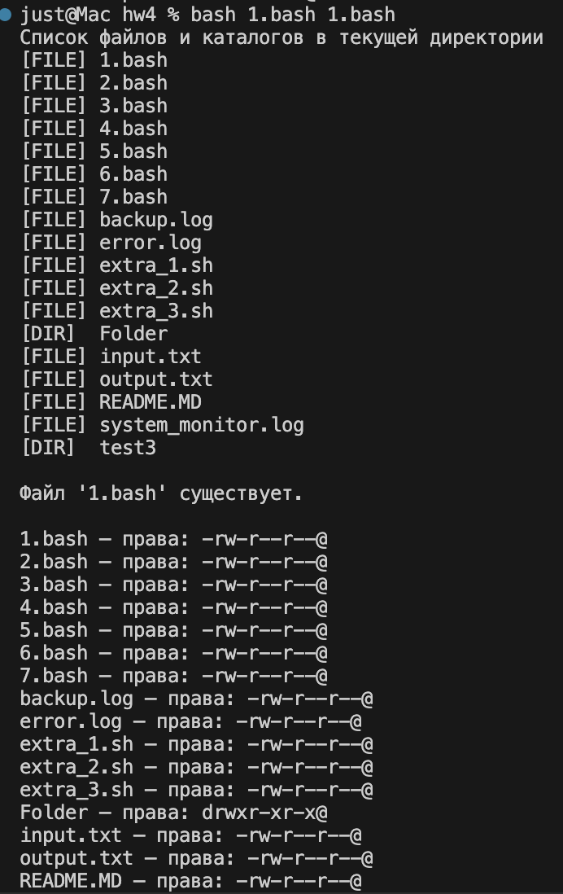
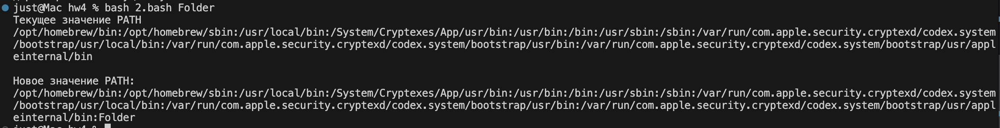
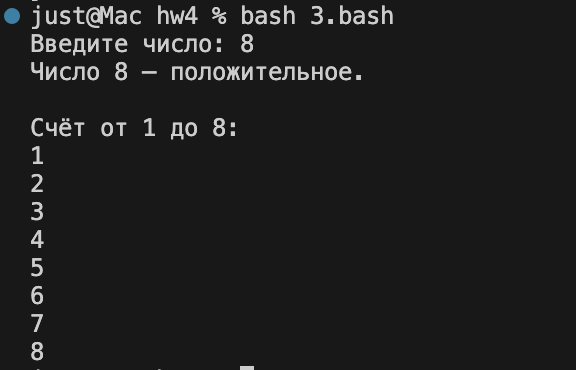
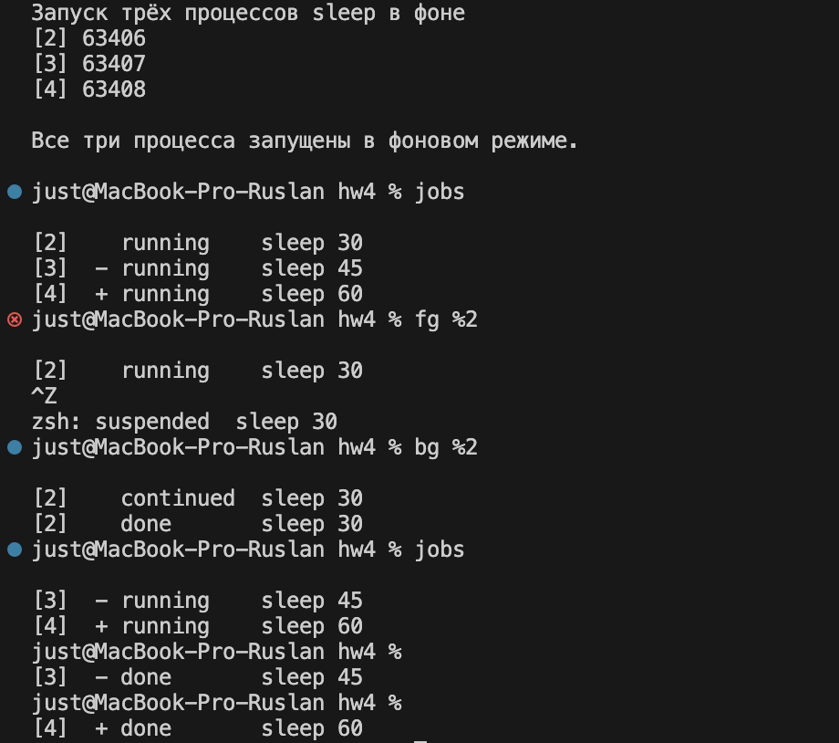
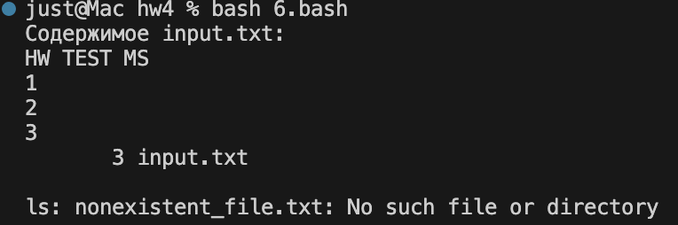
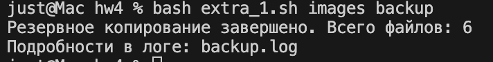
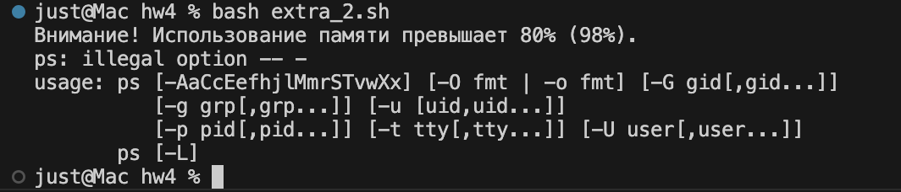
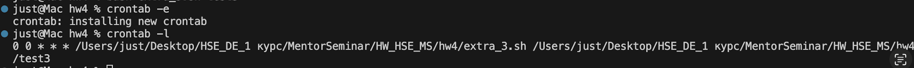

# Результаты выполнения практической работы

## Задача 1

---

## Задача 2

export PATH="$PATH:$NEW_DIR" действует только в текущей сессии оболочки Bash.
После закрытия терминала или запуска нового окна — Bash создаёт новый процесс, который не наследует изменения из предыдущего.
Чтобы новое значение PATH сохранялось между сессиями, нужно добавить команду export в файл конфигурации ~/.bashrc
Добавление можно сделать с помощью команды echo 'export PATH="$NEW_DIR"' >> ~/.bashrc
Чтобы обновить переменные без перезапуска терминала, нужно выполнить source ~/.bashrc

---

## Задача 3

## Задача 4

---

## Задача 5

---

## Задача 6

---

## Задача 7

---

# Усложнённые задания

## Усложнённое задание 1

---

## Усложнённое задание 2

---

## Усложнённое задание 3

