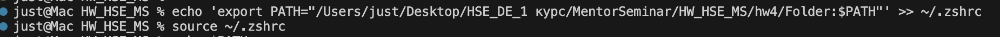
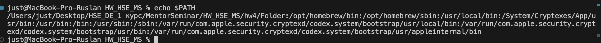
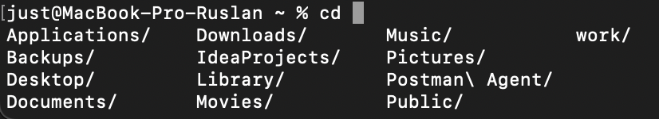
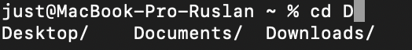

# Результаты выполнения практической работы

## Задача 1

---

## Задача 2

export PATH="$PATH:$NEW_DIR" действует только в текущей сессии оболочки Bash.
После закрытия терминала или запуска нового окна — Bash создаёт новый процесс, который не наследует изменения из предыдущего.
Чтобы новое значение PATH сохранялось между сессиями, нужно добавить команду export в файл конфигурации ~/.zshrc
Добавление можно сделать с помощью команды echo 'export PATH="$NEW_DIR"' >> ~/.zshrc
Чтобы обновить переменные без перезапуска терминала, нужно выполнить source ~/.zshrc

---

## Задача 3

## Задача 4

---

## Задача 5

- Запускаем три процесса в фоновом режиме
- С помощью команды jobs смотрим какие процессы запущены
- Затем с помощью команды fg перевожу процесс на передний план
- С помощью ctrl + z приостанавливаю процесс (процесс становится suspended)
- И с помощью bg возвращаю процесс в фоновый режим (процесс становится continued)
- Еще раз проверяю какие процессы запущены и наблюдаю их завершение (процессы переходят в состояние done)

---

## Задача 6

---

## Задача 7
Как и в задании 2 необходимо добавить alias в файл конфигурации (в моем случае ~/.zshrc), после этого нужно обновить настройки чтобы с помощью команды source ~/.zshrc (что и реализовано в скрипте 7.bash)

Используем автодополнение для команды cd
Если не вводить никаких символов, то автодополнение предложит всё, что есть в директории

Затем добавим один символ "D" и еще раз нажмем Tab. Теперь выводится список всех директорий, начинающихся на D

Выбрать нужную можно с помощью нескольких нажатий на клавишу Tab или дописав еще символы для выбора конкретной директории

---

# Усложнённые задания

## Усложнённое задание 1

---

## Усложнённое задание 2

---

## Усложнённое задание 3

